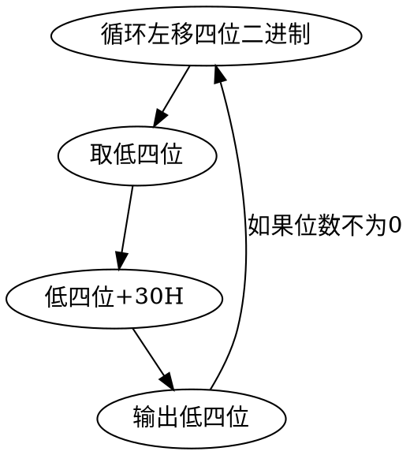

期末复习汇编...真的是好努力的复习...
实验老师让我们做的那几个实验，想想还觉得谢谢了~
谈一下输入输出、分支流程、基本指令，再谈一下做过的几个题目。

<!-- more -->

## 输入输出

### 整数的ASCII码值转为数值

- 0-9  30H-39H  
	可以减去 30H 或者 与上 1111(15)
- A-F  41H-46H  
	减去 37H(55)
- a-z  61H-66H  
	减去 57H(75)


### 输入一位十六进制整数
```asm
IN_1_HEX:
	MOV AH, 01H
	INT 21H     ;输入的值存在AL里
	CMP AL, '9' ;输入的值在内存中都是以ASCII码的值表示
	JBE IN
	SUB AL, 07H
IN:
	SUB AL, 30H
```

### 输入两位十六进制整数
两位十六进制表示的值最多是 `FF` ，也就是 255，用八位就可以存下。
```asm
IN_2_HEX:
	CALL IN_1_HEX ;高位十六进制->AL
	MOV  AH, 10H
	MUL  AH
	MOV  AH, AL
	CALL IN_1_HEX ;低位十六进制->AL
	ADD  AL, AH
```


### 输入一位十进制整数
实际使用的时候记得要保护之前的数据，先 PUSH 再 POP
```asm
IN_1_DEC:
	MOV AH, 01H ;AL
	INT 21H
	SUB AL, 30H
```

### 输入两位十进制整数
```asm
IN_2_DEC:
	CALL IN_1_DEC
	MOV  AH, 10  ; 十六进制这里为10H
	MUL  AH
	MOV  AH, AL
	CALL IN_1_DEC
	ADD  AL, AH
```

### 输出一位十六进制整数
```asm
DISP_1_HEX:
  CMP DL, 09H
  JBE L1
  ADD DL, 07H
L1:
  ADD DL, 30H
  
  MOV AH, 02H
  INT 21H
```

### 输出两位十六进制整数
```asm
DISP_2_HEX:
  MOV AL, DL
  MOV AH, 0
  MOV DL, 10H
  DIV DL        ; 除数是 8 位 AL 存商， AH 存余数 
  MOV DL, AL
  CALL DISP_1_HEX
  MOV DL, AH
  CALL DISP_1_HEX
```
### 输出一位十进制整数
```asm
DISP_1_DEC:
  PUSH AX
  ADD DL,30H 
  MOV AH,02H
  INT 21H
  POP AX
RET
```
### 输出两位十进制整数
```asm
DISP_2_DEC:    ; DL 除十取余法
  PUSH AX
  MOV AL,DL
  MOV AH,0
  MOV DL,10
  DIV DL        ; 除数是 8 位 AL 存商， AH 存余数 
  MOV DL,AL
  CALL DISP_1_DEC
  MOV DL,AH
  CALL DISP_1_DEC
  POP AX
RET
```

### 带符号位的输出多位十进制整数
```asm
DISP:            ; 用十进制出AX中的数
  PUSHF
  PUSH DX
  PUSH AX
  PUSH BX
  PUSH CX
  
  MOV  CX, 0
  MOV  BX, 10    ; 除 10 取余法

  TEST AX, 8000H ; 检测AX首位是1还是0
  JE   DISP1     ; 如果上一句的结果为0，就跳
  CALL FF        ; 输出负号
  NEG  AX        ; 取反+1 

DISP1: 
  MOV  DX, 0
  DIV  BX        ;除数是 16 位 AX,商；DX,余数
  PUSH DX
  INC  CX
  OR   AX, AX    ; 是否商完
  JNE  DISP1     ; 没商完继续商

DISP2: 
  POP  DX
  ADD  DL, 30H   ; 以ascii码输出
  MOV  AH, 02H 
  INT  21H
  LOOP DISP2

  POP  CX
  POP  BX
  POP  AX
  POP  DX
  POPF
RET
FF:
  PUSH DX
  PUSH AX

  MOV  DL, '-'
  MOV  AH, 02H
  INT  21H
  
  POP  AX
  POP  DX  
RET
```
## 循环分支结构
### 比较
最重要的就是 `比较` 了，
`TEST`,`AND`,`CMP`,`SUB` 还有等等等等...都可以拿来做比较。

#### TEST 指令
指令格式： `TEST DST, SRC`
`TEST` 指令可以被用来检测某一位是否为 1，因为其本质就是与运算，也就是 `DST & SRC`，但是不改变源操作数和目标操作数。
如 `00010000 & X` 的结果就表示 X 的倒数第五位是否为 1，要是与出来为 0，就说明这一位为0，否则为1。

#### CMP 指令
指令格式：`CMP DST, SRC`
可以比较两个数的大小，本质就是减法运算，也就是 `DST - SRC`，但是不改变源操作数和目标操作数。

### 跳转指令
这里的就是判断被比较的两个数的具体大小，然后决定执行哪一句。
C-style 的语言中是这样：
```cpp
if (a > b){
  // a > b 的话执行这儿
}else{
  // a <= b 的话执行这儿
}
```
汇编中呢，就是：
```asm
  CMP AX, BX
  JA AGB
  # AX <= BX 的话执行这儿
AGB:
  # AX > BX 的话执行这儿
```

上面的 `JA` 就是一个跳转指令，再详细的各种指令我就不说了，看书~
下面稍微说几个记得牢的~
- JE 两个数相等
- JNE 两个数不相等
- JA 无符号 前者大于后者
  我是这样记得， A 就是两个比较的数里前面那个，B 就是两个比较的数里后面那个，所以 `JA` 就是前面的大。
- JG 有符号比较，前者大于后者
  G 的意思就是 greater than
- JB 无符号 前者小于后者
- JL 有符号比较 前者小于后者
  L = less than
- JAE 无符号大于等于
- JGE 有符号大于等于
- JBE 无符号小于等于
- JLE 有符号小于等于


### 二进制转十六进制
我们都知道，一位十六进制可以表示四位二进制，所以要把二进制转为十六进制的画，得每四位每四位的转换。
大概流程如下


### 控制转移指令
书上P85

## 题目
### 输入二十位带符号十六进制数，排序后输出十进制最大数、最小数、次大数、次小数
```asm
DATA SEGMENT
  X  DW 20 DUP(?)
  NUM DW 6
DATA ENDS
S1 SEGMENT PARA STACK
  BUF1 DW 20H DUP (0)
  LEN1 EQU $-BUF1
S1 ENDS
CODE SEGMENT
ASSUME CS:CODE,DS:DATA,SS:S1
GO:
  MOV  AX,DATA
  MOV  DS,AX
  MOV  AX,S1
  MOV  SS,AX
  MOV  SP,LEN1

  MOV  CX,NUM
  MOV  SI,OFFSET X

L1:
  CALL IN_2_HEX
  MOV  AH, AL
  CALL IN_2_HEX
  MOV  [SI],AX
CC:
  CALL SPACE
  ADD  SI,2
  LOOP L1
  CALL HR
  MOV CX,NUM
  MOV SI,OFFSET X
  DEC CX

LOOP1:
  PUSH CX
  MOV BX,OFFSET X
LOOP2:
  MOV AX,[BX]
  CMP AX,[BX+2]
  JGE CONTINUE     ;有符号比较
  XCHG AX,[BX+2]
  MOV [BX],AX
CONTINUE:
  ADD BX,2
  LOOP LOOP2
  POP CX
  LOOP LOOP1
  MOV cx, NUM
  MOV si,offset X
  CALL HR
  
dispdec2:
  MOV AX,[si]
  call DISP
  call SPACE
  add si,2
  loop dispdec2 
  CALL HR
  
  MOV si,offset X
  CALL HR
  
  ; 最小数
  DEC NUM
  SHL NUM, 1
  ADD SI,NUM
  MOV AX,[SI]
  call DISP
  call SPACE

  ; 最大数
  MOV si,offset X
  MOV AX,[si]
  call DISP
  call SPACE

  ; 次小数

  ADD SI,NUM
  MOV AX,[SI-2]
  call DISP
  call SPACE
  
  ; 次大数
  MOV si,offset X
  MOV AX,[SI+2]
  call DISP
  call HR
  
  MOV AH,4CH
  INT 21H

IN_2_HEX:
  PUSHF
  PUSH BX
  MOV BH,AH
  CALL IN_1_HEX  ;AL  high 
  MOV AH,10H
  MUL AH ;
  MOV AH,AL
  CALL IN_1_HEX  ;AL  low
  ADD AL,AH
  MOV AH,BH
  POP BX
  POPF
RET

IN_1_HEX:
  PUSHF
  PUSH BX
  MOV BH,AH

  MOV AH,01H
  INT 21H
  
  cmp AL,'9'
  JBE IN_B
  SUB AL,07H
IN_B:   ; 'A-F'
  SUB AL,30H
  MOV AH,BH
  POP BX
  POPF
RET


DISP:
  PUSHF
  PUSH DX
  PUSH AX
  PUSH BX
  PUSH CX
  
  MOV CX,0
  MOV BX,10

  test AX,8000H;是否为负
  JE DISP1
  CALL FF
  ;AND  AX,7FFFH
  NEG  AX
  
DISP1: 
  MOV DX,0
  DIV BX     ;AX,商；DX,余数
  PUSH DX
  INC CX
  OR AX,AX   ;是否为0
  JNE DISP1  
DISP2: 
  MOV AH,2
  POP DX
  ADD DL,30H
  INT 21H
  LOOP DISP2
  POP CX
  POP BX
  POP AX
  POP DX
  POPF
RET
   

SPACE:
  PUSH DX
  PUSH AX
  MOV  DL,20H
  MOV  AH,02H
  INT  21H
  POP  AX
  POP  DX  
RET

HR:
  PUSH AX
  PUSH DX
  MOV  AH,02H
  MOV  DL,0AH
  INT  21H
  MOV  DL,0DH
  INT  21H
  POP  DX
  POP  AX 
RET
FF:
  PUSH DX
  PUSH AX
  MOV  DL,'-'
  MOV  AH,02H
  INT  21H
  POP  AX
  POP  DX  
RET
CODE ENDS
END GO
```
